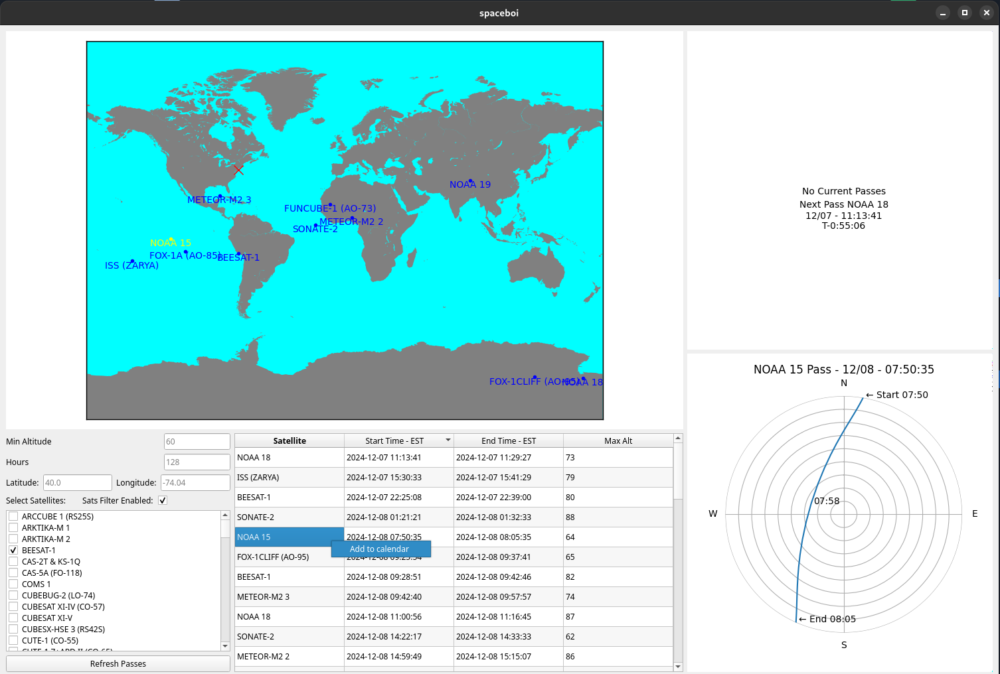

# Spaceboi

Spaceboi gives you the sat events. Period.

A simple satellite pass predictor using TLE data from celestrak.org. It can be
run in a GUI mode or CLI mode. The GUI mode uses Qt to display the passes in a
table, and graph the current events. The CLI mode prints the passes to the
console. The passes can also be plotted using the plot mode.

# Install

Clone the repo and install the requirements

```bash
pip install -r requirements.txt
```

or 

Install from pypi
```
pip install spaceboi
```


# Configuration

The config file by default is stored in ~/.config/spaceboi/config.json. The GUI
settings will automatically be saved to this file. The config file can also be
manually specified using the --config option.

Example config.json
```json
{
    "urls": [
        "https://celestrak.org/NORAD/elements/gp.php?GROUP=weather&FORMAT=json",
        "https://celestrak.org/NORAD/elements/gp.php?GROUP=amateur&FORMAT=json",
    ],
    "lat": 40.7128,
    "lon": -74.006,
    "timezone": "America/New_York",
    "filter_enabled": true,
    "satellites": [
        "NOAA 15",
        "NOAA 18",
        "NOAA 19",
        "METEOR-M2 2",
        "METEOR-M2 3",
        "ISS (ZARYA)",
        "GOES 18"
    ],
    "min_alt": 10,
    "hours": 24,
    "mode": "gui",
    "config": "config.json"
}
```

- urls: list of urls to fetch TLE data from. For now JSON format is supported
- lat: latitude of observer
- lon: longitude of observer
- timezone: timezone of observer
- filter_enabled: filter satellites by name
- satellites: list of satellites for the filter
- min_alt: minimum altitude to display
- hours: number of hours ahead to predict
- mode: the default mode to run the program in
- config: the path to the config file

# Usage

```bash
# A gui to view passes
python spaceboi.py --mode gui

# Print the passes
python spaceboi.py --mode cli

# or

# Plot the passes
python spaceboi.py --mode plot
```

All config options can be used as command line arguments. For example:

```bash
python spaceboi.py --mode gui \
--lat 40.7128 --lon -74.006 --timezone "America/New_York" \
--filter_enabled true \
--satellites "NOAA 15" "NOAA 18" "NOAA 19" "METEOR-M2 2" "METEOR-M2 3" "ISS (ZARYA)" "GOES 18" \
--min_alt 10 --hours 24 --config "config.json"
```
